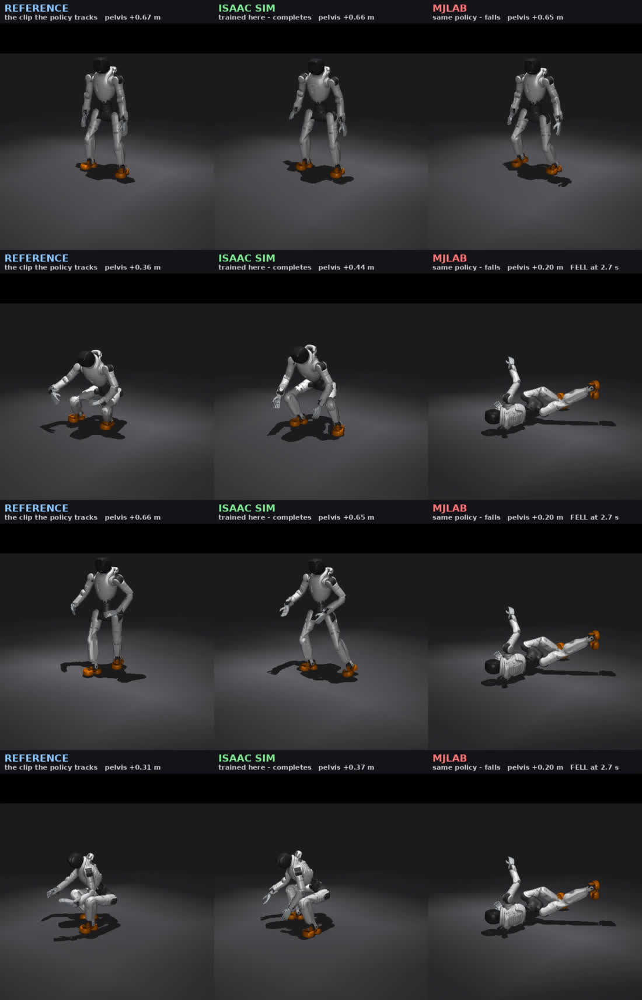

# Box policy v19: mjlab agrees with the robot, Isaac does not

The squat comparison in [`../squat/MJLAB_VS_ISAAC.md`](../squat/MJLAB_VS_ISAAC.md)
found the same npz standing in mjlab and falling in Isaac. This is the same test on
the box policy, and it comes out the other way round — which is the useful direction,
because we also have hardware runs to score both simulators against.

**Result: mjlab and the robot both reject v19. Isaac is the only plant it survives, and
Isaac is the plant it was trained in.**

| plant | outcome | leg-target chatter >5 Hz |
|---|---|---|
| Isaac Sim | completes the pickup, upright at the end | 19.2 mrad |
| mjlab | **falls at 2.7 s**, pelvis −0.57 m | 44.1 mrad |
| hardware | **0 of 6 runs completed** | 33.0 mrad (range 24–49) |

Control, same robot, same day: the squat policy — trained *in mjlab* — runs at
**3.5 mrad** of chatter on hardware and stands up. The box policy is **9.4x noisier**
on the identical machine.

## Videos

Reference, Isaac, and mjlab, same renderer and camera, only the trajectory differs:
[`videos/box_v19_reference_vs_isaac_vs_mjlab.mp4`](videos/box_v19_reference_vs_isaac_vs_mjlab.mp4)

mjlab's own rollout, native render:
[`videos/mjlab_box_v19_pos.mp4`](videos/mjlab_box_v19_pos.mp4)

The mjlab panel is frozen at the fall. Nothing but the feet collides in that plant, so
after the robot is down the body keeps sinking through the floor; the sinking is
bookkeeping, the fall is the result.

## The harness, and why its output can be believed

`run_box_mjlab.py` drives the mjlab X2 with the deploy script's own observation layout
(actions, base_ang_vel, dof_pos, dof_vel, motion_command, motion_ref_ori_b —
alphabetical, 164 wide) and holosoma's explicit clipped-PD torque, so the actuator
model matches Isaac and only the plant changes.

A harness like this is worthless unless it feeds the network the same numbers holosoma
does, so `validate_obs_vs_isaac.py` replays Isaac's *own logged state* through the
builder and compares the predicted action to the action Isaac logged. No simulator in
the loop, deterministic MLP, so a correct builder has to reproduce it.

- per-joint correlation with Isaac's logged actions: **mean 0.995, median 0.9985**
- bias: **0.035** against an action standard deviation of **5.68** (0.6%)

The residual that remains is Isaac's own training-time observation noise, which is
uniform ±0.5 rad/s on `dof_vel` and ±0.2 on `base_ang_vel` and cannot be reproduced
from outside. Injecting that configured noise into the clean observation moves the
predicted action by 0.197, against an observed residual of 0.268 — same size. The
builder is correct.

Two controls worth recording. Holding the frame-0 pose open loop topples in **both**
drive models identically (MuJoCo's implicit position servo and holosoma's explicit
torque), which is correct inverted-pendulum physics — ankle stiffness is 40–60 N·m/rad
against an m·g·h of roughly 300 — and it confirms the two drive models are equivalent
here, so the drive model is not what separates the plants. And the mjlab run used
*clean* observations while Isaac ran with noise, so mjlab was given the easier problem
and still failed.

## What actually differs between the plants

| | mjlab | holosoma / Isaac |
|---|---|---|
| collision geometry | **feet only** — 12 sphere geoms | full-body URDF meshes |
| self-collision | **off** (`contype=0 conaffinity=0` on every mesh) | **`enable_self_collisions=True`** |
| drive | MuJoCo position servo, implicit | explicit torque PD, clipped |
| integrator / dt | implicitfast, 5 ms, Newton ×100 | PhysX, 5 ms |
| control rate | 50 Hz (decimation 4) | 50 Hz (decimation 4) |

The X2 MJCF disables contact on every mesh collider and enables it only on the twelve
foot spheres, and `x2_constants.py` says why: *"the most robust setup for a first flat
-ground walking policy, avoids self-collision instabilities."* Holosoma's box config
does the opposite at `box_clean_grasp.py:814`.

That is consistent with the squat finding, where Isaac's contact sensor reported
multi-kN torso/wrist/knee forces at t = 0 with the robot merely standing, forces mjlab
never sees. Phantom contact forces are free stabilisation: a policy trained against
them learns to lean on contacts that do not exist on the robot, which is exactly the
failure mode we keep shipping.

## Recommendation: move tracking training to mjlab

`Mjlab-Tracking-Flat-X2` already exists and is a BeyondMimic-style whole-body tracking
task wired for this robot — the 31 DoF, the foot geoms, thirteen tracking bodies
including both wrists and ankles, a self-collision sensor, and a principled per-joint
action scale of `0.25 * effort / stiffness`. (Worth noting: that heuristic puts
`ankle_roll` at 0.15, where we spent days arguing between 0.02 and 0.06.)

The motion format is the same BeyondMimic npz, so the clip mostly ports as-is:

- `joint_pos` (591, 38) → (591, 31), drop the 7 leading root columns
- `joint_vel` (591, 37) → (591, 31), drop the 6 leading root columns
- `body_pos_w` / `body_quat_w` / `body_lin_vel_w` / `body_ang_vel_w` (591, 46, ·) →
  reorder and subset from our 46 names to mjlab's 33 model bodies (ours carries
  `world`, ten ankle spheres, two hand contact links and `largebox_link`)

The real work is the box. mjlab's tracking task has no object, so carrying
`object_pos_w` / `object_quat_w` over means adding the box body to the scene and an
object-tracking command term. That is a genuine piece of work, but it is bounded, and
it is small next to continuing to certify policies in a simulator that disagrees with
the robot.

## Scripts

| file | what it does |
|---|---|
| `run_box_mjlab.py` | rolls the exported policy on the mjlab plant, dumps npz + mp4 |
| `validate_obs_vs_isaac.py` | proves the observation builder reproduces Isaac |
| `compare_box_three_way.py` | mjlab vs Isaac vs the six hardware runs, plus the squat control |
| `render_box_plants.py` | the three-panel video |
