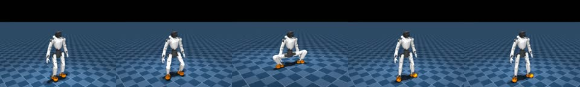
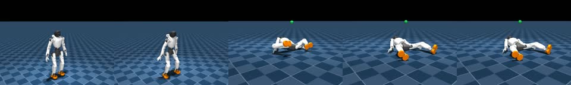
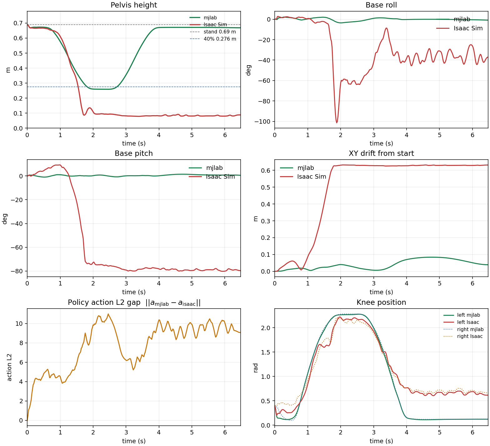

# Same 40% squat policy: mjlab succeeds, Isaac Sim falls

Short version: the exact npz that squats in mjlab (`x2_squat_policy_40pct_iter16499.npz`)
was rolled on the existing Holosoma Isaac Sim X2 plant. **mjlab completes the cycle.
Isaac pitches over on the way down and stays on the floor.** Height tracks for about
0.9 s; first gap > 2 cm at **0.88 s**; Isaac pelvis is on the ground by **1.7 s**.

This is a sim-to-sim plant gap, not a policy export bug. Step 0 matches mjlab to
~1e-7 (pose, obs, command, first action). The closed loop has already diverged by
0.1 s.

Interactive Cursor canvas (charts + stills):
[`squat-mjlab-vs-isaac.canvas.tsx`](squat-mjlab-vs-isaac.canvas.tsx).
GitHub will not render that file as a canvas — this page is the reviewable copy.

## 1. The artifacts

| what | where |
|---|---|
| policy (same on both sides) | `agibot_control_functions/policies/x2_squat_policy_40pct_iter16499.npz` |
| mjlab video (native RGB) | [`videos/mjlab_squat_40pct_iter16499.mp4`](videos/mjlab_squat_40pct_iter16499.mp4) |
| Isaac video (states replayed in mjlab viewer) | [`videos/isaac_squat_40pct_iter16499.mp4`](videos/isaac_squat_40pct_iter16499.mp4) |
| plots | [`videos/mjlab_vs_isaac_plots.png`](videos/mjlab_vs_isaac_plots.png) |
| mjlab rollout dump | `compare/mjlab_rollout.npz` |
| Isaac rollout dump | `compare/isaac_rollout.npz` |
| numbers behind the canvas | `compare/canvas_data.json` |
| dump / compare scripts | `dump_squat_mjlab.py`, `run_squat_isaac.py`, `compare_squat_sims.py` |

Isaac Kit RTX cameras cannot run headless on this box, so the Isaac clip is the
Isaac pelvis/joint trajectory kinematically replayed in the mjlab viewer — the
motion is Isaac's, the renderer is not.

## 2. Videos

mjlab (stands, squats to 40%, stands again):

Isaac Sim (descent collapses ~1.6 s):

Click the strip (or the mp4 links in the table) to play.

## 3. Outcome

325 steps @ 50 Hz (6.5 s). Standing pelvis 0.69 m, 40% target 0.276 m.

| metric | mjlab | Isaac Sim |
|---|---|---|
| Success (reach bottom, stand up, stay upright) | **yes** | **no** |
| Min pelvis height | 0.276 m (on target) | 0.079 m (on floor) |
| Final pelvis height | 0.686 m | 0.088 m |
| Max \|roll\| / \|pitch\| | 3.6° / 1.5° | 101° / 80° |
| XY drift (max) | 0.084 m | 0.632 m |
| Pelvis height RMSE | — | 0.42 m |
| Joint-pos RMSE (all 31) | — | 0.228 rad (13.1°) |
| Action RMSE (after shared step 0) | — | 1.46 |

Largest joint RMSE over the full 6.5 s (including after the fall): right wrist
roll 24.9°, right wrist pitch 24.5°, right knee 23.1°. Wrists and the right leg
dominate because the fallen pose is unconstrained.

## 4. What was matched

The npz, observation layout (102-D), command, default pose, and PD gains were the
same on both sides. Isaac boots `20260730_215012-x2_box_v31_flatfoot` only to
construct the X2 articulation, then `q_des = default + action_scale * action` is
applied through the WBT action scales so the position target is the squat target.
Armature 0.03 and friction 0.3 (mjlab `x2.xml`). Virtual gantry off. WBT box
teleported to (20, 20, 1) every step — confirmed in the dump. Terminations and
observation noise off.

## 5. What still differs

Remaining plant gap: PhysX with Holosoma's explicit torque PD and full-body URDF
colliders (self-collisions on) versus MuJoCo implicit position actuators and
feet-only geoms. Knee/thigh/torso collision meshes could not be disabled at
runtime: they live on USD instance proxies, and uninstancing them after PhysX is
cooked kills the backend. Contact sensor already reports multi-kN torso/wrist/knee
forces at t = 0 while the robot is still standing, which mjlab never sees. That is
the likely reason the same policy falls in Isaac and not in mjlab.
