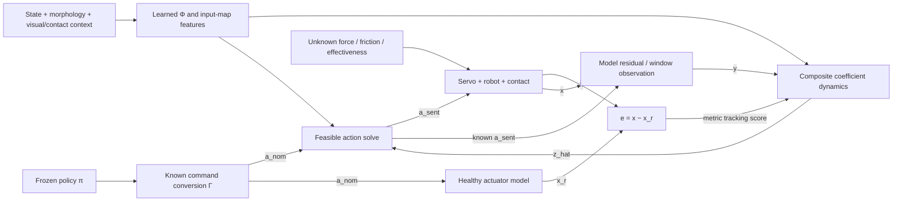

# Independent learned-adaptation research direction

This project develops a nominal actuator/control model and learned disturbance and
input-effectiveness representations around a frozen policy. Online adaptation acts
on low-dimensional coefficients using prediction and tracking errors. The canonical
repository is [fxxie2/vla_adaptation](https://github.com/fxxie2/vla_adaptation), with
`review/dual-track-audit` as the current branch. This checkout's `fxxie2` remote
publishes that branch to both the canonical repository and
[mtaheriee/vla-adaptation](https://github.com/mtaheriee/vla-adaptation) on plain
`git push`; commits remain local until pushed. Verify both destinations because
either update can fail independently. This local configuration is not inherited
by new clones. Dual publication does not change the independent research direction:
the historical repository's `main` is not an automatic merge source, and inherited
code and authorship remain intact.

## Read in this order

1. [Complete equations and assumptions](FORMULATION.md): signs, nominal models,
   composite/Riccati update, derivation, discrete timing, gripper/contact model,
   additive versus effectiveness faults, geometry and optional mirror descent.
2. [MAGIC, Neural-Fly and HMAC comparison](adaptation_sources.md): what each paper
   actually learns and controls; exact source pages/equations and implementation
   cautions. These are related architectures, not interchangeable formulas.
3. [Actuator-interface audit](interface_model_audit.md): what Panda, ALOHA and GR1
   expose, gripper conversion/saturation, nominal-model identification and contact.
4. [Five supplied geometry papers](manifold_review.md): directly useful structures,
   valid symmetry groups, limitations and verified paper/code sign differences.
5. [Prospective paper and evaluation plan](../../paper/INDEPENDENT_PAPER_PLAN.md):
   contribution hypotheses, comparisons and the nine-page narrative budget.
6. [Geometric method specification](GEOMETRIC_METHOD.md): wrench/command units,
   constructive finite-group bases, asymmetric fault coefficients, and consistent
   estimator/effectiveness/allocation transport with exact identity tests.

## The corrected special case

For the same nominal command expressed in modeled input coordinates,

\[
 B\dot x=Ax+a_{\rm sent}+\Phi(\xi)z,
 \qquad B\dot x_r=Ax_r+a_{\rm nom},
 \qquad a_{\rm sent}=a_{\rm nom}-\Phi(\xi)\hat z.
\]

With \(e=x-x_r\), choose \(L\succ0\) so that
\((B^{-1}A)^\top L+L(B^{-1}A)\prec0\), and form
\(y=B\dot x-Ax-a_{\rm sent}\). Then

\[
 \dot{\hat z}=-\Lambda_z\hat z
  +P\Phi^\top R^{-1}(y-\Phi\hat z)
  +P\Phi^\top B^{-\top}Le,
 \qquad
 \dot P=-\Lambda_zP-P\Lambda_z^\top+Q_z-P\Phi^\top R^{-1}\Phi P.
\]

This is a conditional first-order formulation. Physical second-order dynamics,
restricted Cartesian input, actuator effectiveness and contact require the explicit
extensions in the full document. The feature network has not yet been trained.

## Signal path



The diagram's healthy model includes known actuator behavior; intended contact is
not automatically a fault. Geometry conditions the features and their transformations,
not the number of actuation directions available to the robot.

## Implemented now

[`learned_adaptation/core.py`](../../learned_adaptation/core.py) is a NumPy reference
implementation of the local descriptor model, known-input residual, exact unconstrained
allocation with an explicit action metric, continuous composite coefficient/covariance right-hand side and integral
observation construction. It accepts a supplied basis; it contains no feature-training
pipeline and is not connected to any robot runner.

The [eleven mathematical regression tests](../../learned_adaptation/test_core.py) check
compensation signs, prediction residuals, additive versus gain faults, missing authority,
input-nullspace preservation, window integration, covariance validity, noncommuting
forgetting, zero-order-hold timing, and consistency under changes of
state/row/latent/action coordinates. The Lyapunov
identity is checked in 128 synthetic cases. These tests are not robot trials or evidence
that a learned basis improves task success.

[`geometry.py`](../../learned_adaptation/geometry.py) adds power-preserving wrench
frame changes, explicit mechanical/servo feature maps, finite-group basis
projection, effectiveness tensors and complete estimator/allocator transport.
The [geometric tests](../../learned_adaptation/test_geometry.py) check exact
identities including estimator commutation with recomputed features. No physical
robot symmetry or torque-to-command compliance is inferred by this library.

```sh
python -m unittest learned_adaptation.test_core learned_adaptation.test_geometry -v
```

## First implementation study

Use ALOHA's actual joint-target interface to establish the nominal model, including
finger conversion, limits and contact. Do not choose a q-only model if held-out data
require velocity, actuator memory or a contact state. Train a shared feature model on
separate disturbance environments, fix its weights, then compare prediction-only and
composite coefficient updates using the same model/features and a prespecified tuning
budget. Add context, hierarchical features and valid symmetry constraints as separate
ablations. Include healthy harm, all joints, grippers and held-out contact conditions.

MAGIC-style effectiveness identification requires excited commands and an explicit
estimated input map. A lock or correction outside the available input directions is
a declared authority limitation, not an invitation to increase adaptation gain.
A new Panda torque interface would be a different experiment from the inherited
Cartesian-command benchmark.

## Historical evidence and paper status

The existing [nine-page ICLR manuscript](../../paper/iclr_draft.pdf), old FIR runners,
all-joint fault data and estimator tuning remain a documented predecessor study.
They motivate this direction and provide baselines. Their results must not be renamed
as evidence for a learned-basis controller. The old top-level project description is
preserved at [its historical snapshot](../legacy/README_687650f.md); some claims there
were subsequently qualified by the audits and should be read with that context.

The new [paper plan](../../paper/INDEPENDENT_PAPER_PLAN.md) separates a proposed
contribution from missing measurements. No new rollout, trained basis, superiority
claim or task-level recovery guarantee is created by this formulation change.
